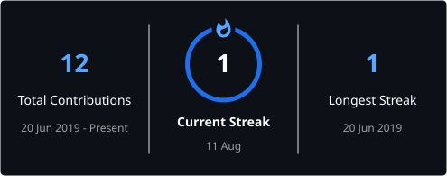

# 👋 Hi, I'm Osman

### `Osm4Nx` · Developer · Builder · Founder @ KingByte Studios

Building modern web experiences, software products, and games.

 

&nbsp;

&nbsp;

 
 

---

## 🚀 About Me

I'm **Osman**, a developer from Türkiye focused on building modern digital products and interactive experiences.

My work spans across **frontend development, full-stack web applications, game development, UI/UX, and software architecture**.

I enjoy taking an idea from **concept → design → development → deployment** and turning it into something people can actually use.

### Currently

- 🔭 Building **[KingByte Studios](https://kingbytestudios.com/)**
- 🌐 Developing modern web applications and digital products
- 🎮 Working on Roblox game development and gameplay systems
- ⚡ Building with modern JavaScript / TypeScript ecosystems
- 🎨 Designing interfaces with a strong focus on UX and visual quality
- 🧠 Exploring new technologies and development workflows
- 🛠️ Interested in scalable architecture, automation, and developer tooling

---

## 🏢 KingByte Studios

 
 

**A development studio focused on building games, software, websites, and digital experiences.**

 

---

# 🧰 Tech Stack

## 💻 Languages

&nbsp;

&nbsp;

&nbsp;

&nbsp;

&nbsp;

&nbsp;

---

## ⚛️ Frontend & Frameworks

&nbsp;

&nbsp;

&nbsp;

&nbsp;

&nbsp;

---

## 🗄️ Backend & Databases

&nbsp;

&nbsp;

&nbsp;

&nbsp;

---

## 🛠️ Tools & Platforms

&nbsp;

&nbsp;

&nbsp;

&nbsp;

---

# 📊 GitHub Analytics

 

---

# 📈 Contribution Activity

---

# 🐍 Contribution Snake

<picture>
  <source
    media="(prefers-color-scheme: dark)"
    srcset="https://raw.githubusercontent.com/osm4nx/osm4nx/output/github-snake-dark.svg"
  />
  <source
    media="(prefers-color-scheme: light)"
    srcset="https://raw.githubusercontent.com/osm4nx/osm4nx/output/github-snake.svg"
  />
  
</picture>

---

# 🔥 Contribution Streak

---

# 🏆 GitHub Achievements

> GitHub's native profile achievements are displayed directly on the profile and are intentionally linked rather than loaded through an external trophy API.

---

# 🚀 Featured Work

 
 

---

# 🎮 What I Build

| 🌐 Web | ⚛️ Frontend | 🗄️ Backend |
|:---:|:---:|:---:|
| Modern web applications | React / Next.js / TypeScript | APIs / Databases / Architecture |

| 🎮 Games | 🎨 UI / UX | ☁️ Deployment |
|:---:|:---:|:---:|
| Roblox / Gameplay Systems | Interfaces / Design Systems | Cloud / CI / Production |

---

# 🧠 Development Philosophy

> **Build it. Improve it. Ship it.**

I care about more than simply making something work.

My focus is on:

- ⚡ Performance
- 🧩 Maintainable architecture
- 🎨 Clean and intuitive UI
- 🔐 Security-conscious development
- 📱 Responsive experiences
- ♻️ Reusable systems
- 📈 Scalability
- 🛠️ Developer experience
- 🚀 Production-ready implementations

---

# 🌐 Connect With Me

&nbsp;

&nbsp;

---

### 💻 Thanks for visiting my profile!

**If you find something interesting, feel free to ⭐ a repository.**

 

 
 

Built with ❤️ by <a href="https://github.com/osm4nx">Osm4Nx</a>

